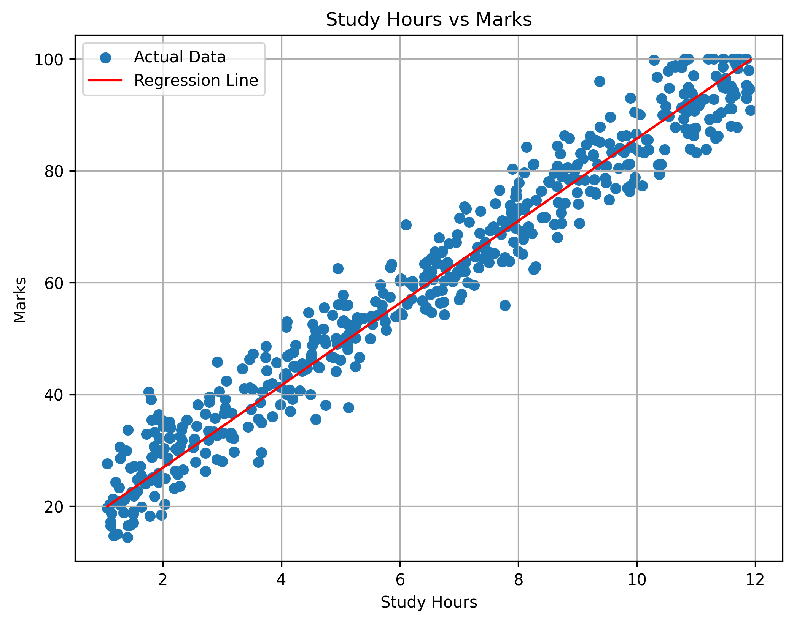
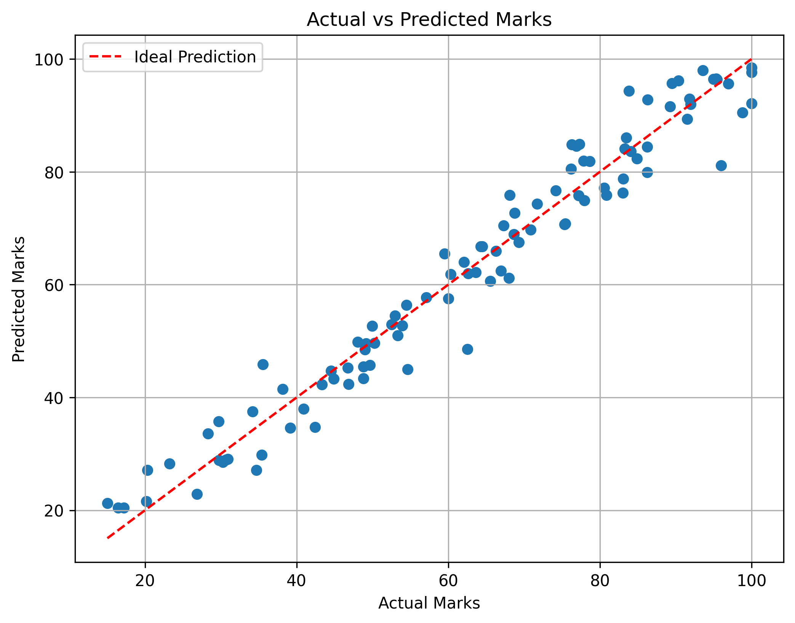

# Gradient Descent From Scratch

## Overview

This project implements Gradient Descent for Simple Linear Regression from scratch using Python and NumPy.

The model predicts student marks based on study hours. The scratch implementation is evaluated and compared with scikit-learn's Linear Regression model using the same training and testing data.

## Dataset

The dataset contains the following columns:

- `StudyHours` - Number of hours studied
- `Marks` - Marks obtained by the student

Dataset details:

- Original rows: 500
- Rows after duplicate removal: 499
- Input feature: StudyHours
- Target variable: Marks

## Features

- Dataset loading and overview
- Missing value and duplicate analysis
- Duplicate row removal
- Feature and target separation
- Train-test splitting
- Gradient Descent implementation from scratch
- Prediction using the trained scratch model
- Model evaluation using regression metrics
- Scikit-learn Linear Regression implementation
- Scratch model vs scikit-learn comparison
- Regression line visualization
- Actual vs predicted marks visualization

## Project Structure

```text
Gradient_Descent/
│
├── data/
│   └── student_marks_regression.csv
│
├── graphs/
│   ├── actual_vs_predicted.png
│   └── regression_line.png
│
├── data_overview.py
├── data_preprocessing.py
├── GD.py
├── train.py
├── sklearn_model.py
├── compare.py
├── visualisation.py
├── requirements.txt
└── README.md
```

## Gradient Descent Model

The scratch model starts with:

```text
Slope = 0
Intercept = 0
```

During every epoch, the model:

1. Calculates predicted marks
2. Calculates gradients for slope and intercept
3. Updates slope and intercept using the learning rate
4. Repeats the process for the specified number of epochs

The prediction equation is:

```text
Predicted Marks = Slope × Study Hours + Intercept
```

## Model Evaluation

### Gradient Descent From Scratch

| Metric | Result |
|---|---:|
| MAE | 3.7283 |
| MSE | 22.5211 |
| RMSE | 4.7456 |
| R² Score | 0.9572 |

### Scikit-learn Linear Regression

| Metric | Result |
|---|---:|
| MAE | 3.6542 |
| MSE | 22.5545 |
| RMSE | 4.7492 |
| R² Score | 0.9571 |

## Model Comparison

The scratch Gradient Descent model achieved nearly the same performance as scikit-learn's Linear Regression model.

The small difference between the results confirms that the Gradient Descent implementation is working correctly.

## Visualizations

### Regression Line



### Actual vs Predicted Marks



## Technologies Used

- Python
- NumPy
- Pandas
- Matplotlib
- Scikit-learn

## How to Run

Install the required libraries:

```bash
pip install -r requirements.txt
```

Run the scratch Gradient Descent model:

```bash
python Gradient_Descent/train.py
```

Run the scikit-learn model:

```bash
python Gradient_Descent/sklearn_model.py
```

Run the model comparison:

```bash
python Gradient_Descent/compare.py
```

Generate the visualizations:

```bash
python Gradient_Descent/visualisation.py
```

## Status

Project completed.