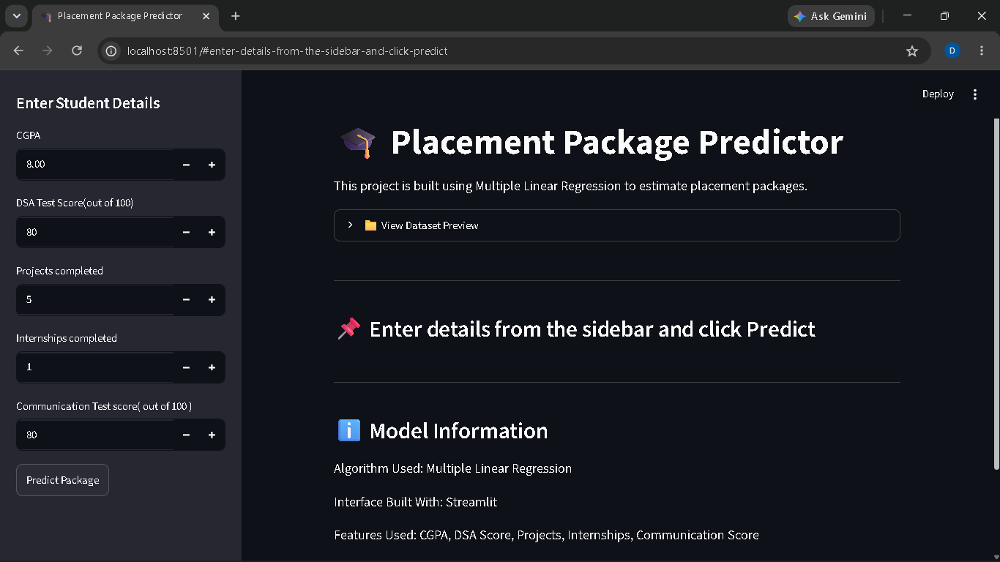
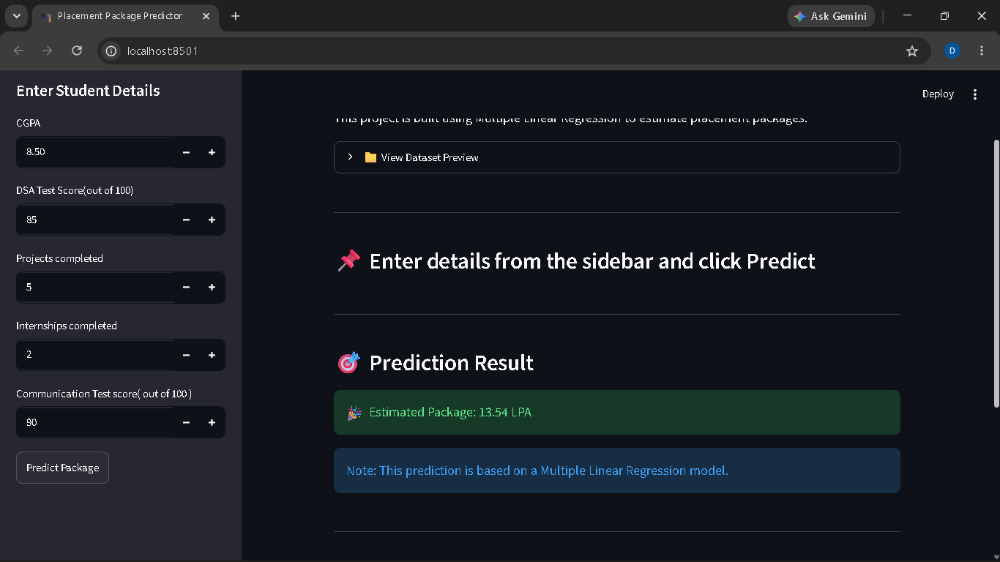

# 🎓 Placement Package Predictor using Multiple Linear Regression

This is my Multiple Linear Regression project built using Python.

In this project, I first implemented Multiple Linear Regression using **Scikit-learn** and then created a simple **Streamlit Dashboard** to make the prediction interactive.

The model predicts the expected placement package of a student based on different academic and skill-related features.

---

## 🚀 Features

- Placement package prediction
- Multiple Linear Regression
- Interactive Streamlit Dashboard
- Dataset Preview
- User Input from Sidebar
- Instant Prediction

---

## 📂 Project Structure

```text
Multiple_Linear_Regression/

│
├── data/
│   └── placement_package_regression.csv
│
├── MY_MLR_MODEL.py
├── MLR_Sklearn.py
├── comparison.py
├── app.py
│
├── README.md
└── requirements.txt
```

---

## 📊 Input Features

- CGPA
- DSA Score
- Projects Completed
- Internships Completed
- Communication Score

---

## 🎯 Target

Placement Package (LPA)

---

## 🖥️ Streamlit Dashboard

The project also includes a simple Streamlit interface where you can:

- Enter student details
- View dataset preview
- Predict placement package instantly


---

## 🛠️ Technologies Used

- Python
- NumPy
- Pandas
- Scikit-learn
- Streamlit

---

## ▶️ How to Run

### Install Required Libraries

```bash
pip install -r requirements.txt
```

### Run Scikit-learn Model

```bash
python MLR_Sklearn.py
```

### Compare Models

```bash
python comparison.py
```

### Launch Streamlit App

```bash
python -m streamlit run app.py
```

---

## 📈 Future Improvements

- Multiple Linear Regression from Scratch using Gradient Descent
- Batch Gradient Descent
- Stochastic Gradient Descent
- Mini Batch Gradient Descent
- Better Dashboard UI
- Real-world Dataset

---

## 🖥️ Dashboard Preview

### Before Prediction

<p align="center">

</p>

### After Prediction

<p align="center">

</p>
## 👨‍💻 Author

**Giridhar Jadon**

B.Tech (Artificial Intelligence & Machine Learning)